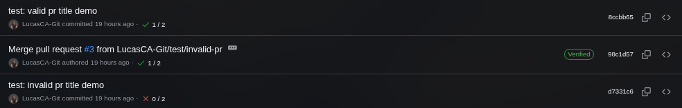
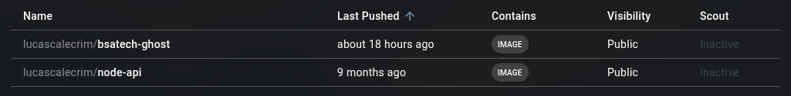
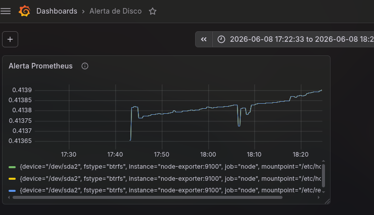
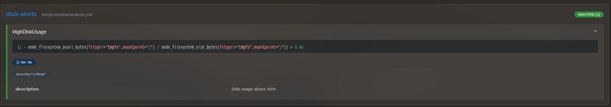
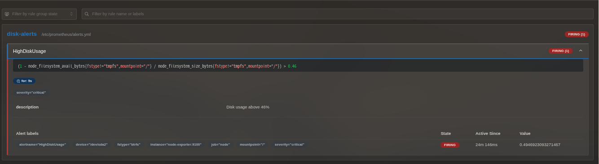
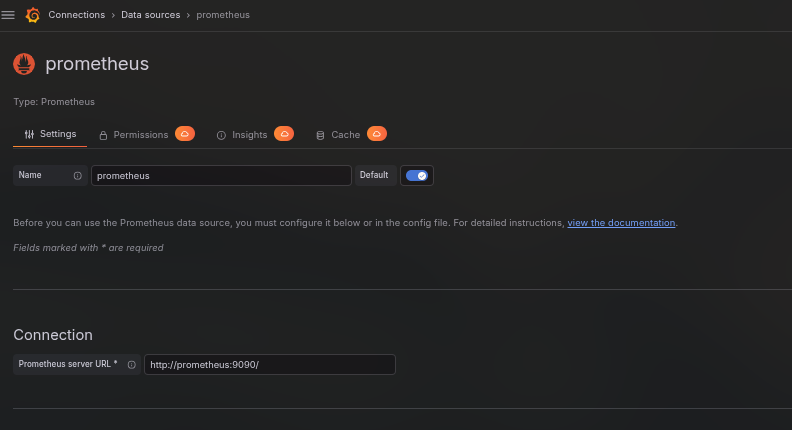
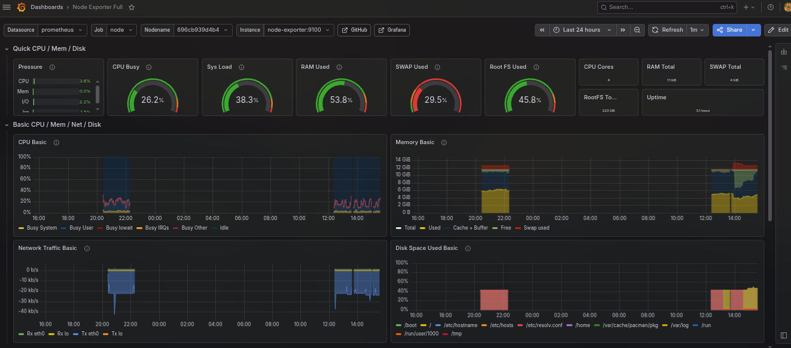
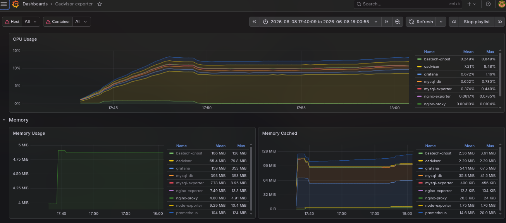
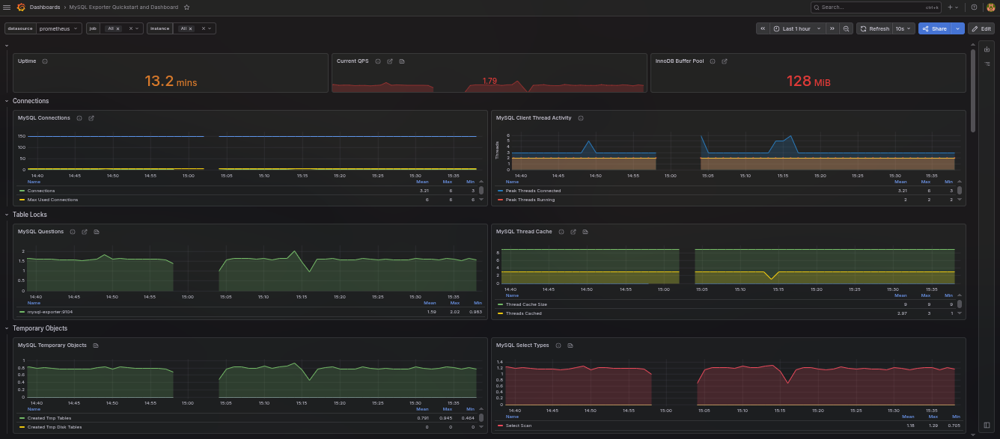
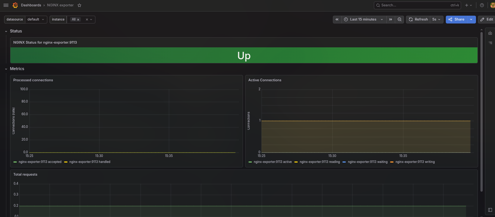

# BSA Tech DevOps Challenge

## Visão Geral

Este projeto foi desenvolvido como solução para o desafio técnico DevOps proposto pela BSA Tech.

O objetivo foi construir um ambiente completo para execução de um blog utilizando containers Docker, contemplando aspectos essenciais de um ambiente moderno de produção, como persistência de dados, segurança, monitoramento, observabilidade, automação de backup e validações contínuas através de pipeline CI.

## 📌 Sumário
* [1. Visão Geral e Pré-requisitos](#visão-geral)
* [2. Arquitetura e Decisões Técnicas](#principais-decisões-técnicas)
* [3. Segurança e Configuração HTTPS](#segurança)
* [4. Pipeline de CI (GitHub Actions)](#integração-contínua-ci)
* [5. Automação de Backup e Restore](#backup-e-restore)
* [6. Monitoramento e Alertas de Volume](#alerta-de-volume)
* [7. Validação Automatizada (Smoke Test)](#smoke-teste)
* [8. Observabilidade e Dashboards Grafana](#observabilidade)

##  Checklist de Requisitos do Desafio

- [x] **Ordem correta de inicialização (`depends_on` + `healthcheck`):** Configurado no serviço do MySQL e mapeado com `condition: service_healthy` no Ghost.
- [x] **Persistência de dados por volumes:** Mapeamento completo e seguro utilizando os volumes estruturados `mysql_data` e `ghost_data`.
- [x] **Nginx com HTTPS, redirecionamento e cabeçalhos:** Arquivo `nginx.conf` detalhado com suporte a TLS e container dinâmico `cert-generator` (via `init-certs.sh`) automatizando os certificados.
- [x] **Imagem própria publicada no Docker Hub:** Build e Push estruturados de forma automatizada com imagem pública consumida diretamente no ambiente.
- [x] **Tratamento de segredos via `.env`:** Uso de variáveis de ambiente centralizadas com arquivo `.env.example` limpo para livre configuração do avaliador.
- [x] **Backup e Restore automatizados em Shell:** Scripts `backup.sh` e `restore.sh` funcionais sob a pasta `scripts/` e totalmente documentados.
- [x] **Monitoramento e Observabilidade (Prometheus + Grafana):** Ecossistema completo integrado com coletores automatizados e tabela de IDs dos dashboards pronta para importação.
- [x] **Alertas de volume + forma automatizada de forçar:** Regra de monitoramento de disco ativa no Prometheus associada ao script de estresse controlado `test.sh`.
- [x] **Testes pós-subida (*Smoke Test*):** Script automatizado `validate.sh` realizando validações de integridade de portas, códigos HTTP e endpoints de métricas.
- [x] **Pipeline de CI para títulos de PR:** Workflow do GitHub Actions estruturado com validação de formato via expressão regular (*Conventional Commits*).

A stack escolhida foi:

* **Ghost** como plataforma de blog
* **MySQL 8.0** como banco de dados
* **Nginx** como proxy reverso e terminador TLS
* **Prometheus** para coleta de métricas
* **Grafana** para visualização e observabilidade
* **Node Exporter** para métricas do host
* **cAdvisor** para métricas de containers
* **MySQL Exporter** para métricas do banco de dados
* **NGINX Prometheus Exporter** para métricas do proxy reverso

- O ambiente foi projetado para que um simples e que seja suficiente para disponibilizar todos os serviços necessários.

```bash
git clone https://github.com/LucasCA-Git/BSAtech-DevOps.git
docker compose up 
```

- Variaveis de ambiente para .env
- pode utilizar o .env.example como base 

```conf
MYSQL_ROOT_PASSWORD=sua_senha_root_segura
MYSQL_DATABASE=ghost
MYSQL_USER=ghost
MYSQL_PASSWORD=sua_senha_ghost_segura

GRAFANA_ADMIN_USER=admin
GRAFANA_ADMIN_PASSWORD=sua_senha_grafana_segura
```
---

# Principais Decisões Técnicas
# Ghost

Foi escolhido o Ghost por ser uma aplicação moderna baseada em Node.js, amplamente utilizada para publicação de conteúdo e compatível com ambientes containerizados.


```yml
  ghost:
    image: lucascalecrim/bsatech-ghost:1.0
    container_name: bsatech-ghost
    depends_on:
      mysql:
        condition: service_healthy
    environment:
      database__client: mysql
      database__connection__host: mysql
      database__connection__user: ${MYSQL_USER}
      database__connection__password: ${MYSQL_PASSWORD}
      database__connection__database: ${MYSQL_DATABASE}
      url: https://localhost
    expose:
      - "2368"
    volumes:
      - ghost_data:/var/lib/ghost/content
    networks:
      - bsatech-net
```

# MySQL

O MySQL foi utilizado como banco de dados relacional principal devido à sua ampla adoção no mercado e compatibilidade nativa com o Ghost.

```yml
  mysql:
    image: mysql:8.0
    container_name: mysql-db
    environment:
      MYSQL_ROOT_PASSWORD: ${MYSQL_ROOT_PASSWORD}
      MYSQL_DATABASE: ${MYSQL_DATABASE}
      MYSQL_USER: ${MYSQL_USER}
      MYSQL_PASSWORD: ${MYSQL_PASSWORD}
    volumes:
      - mysql_data:/var/lib/mysql
    healthcheck:
      test: ["CMD", "mysqladmin", "ping", "-h", "localhost"]
      interval: 10s
      timeout: 5s
      retries: 10
    networks:
      - bsatech-net
```

# Docker Compose

Toda a infraestrutura foi definida através de Docker Compose utilizando a sintaxe mais recente, permitindo que o ambiente seja reproduzido facilmente em qualquer host compatível com Docker.

# Persistência de Dados

Todos os dados críticos são persistidos através de volumes Docker dedicados:

* `ghost_data`
* `mysql_data`

```yml
volumes:
  mysql_data:
  ghost_data:
```

Dessa forma, reinicializações ou recriações dos containers não afetam os dados da aplicação.

# Segurança

O Nginx foi configurado para:

* Redirecionamento automático HTTP → HTTPS
* Utilização de certificados TLS
* Cabeçalhos de segurança HTTP
* Restrição de acesso a arquivos sensíveis
* Encapsulamento da aplicação atrás de proxy reverso

# Container shell para rodar o script 

- Script para gerar os certificados https no proprio compose.yml
```yml
cert-generator:
    image: alpine:latest
    container_name: cert-generator
    volumes:
      - ./nginx/certs:/certs
      - ./scripts/init-certs.sh:/init.sh:ro
    entrypoint: sh -c "apk add --no-cache openssl && sh /init.sh"
```
# Script para Configuração do HTTPS 

- O script esta em scripts/init-certs.sh
```bash
#!/bin/sh
set -e

GREEN='\033[0;32m'
YELLOW='\033[1;33m'
NC='\033[0m'

CERT_DIR=/certs
mkdir -p "$CERT_DIR"

if [ ! -f "$CERT_DIR/nginx.crt" ]; then
  echo "${YELLOW}Gerando certificado autoassinado...${NC}"
  openssl req -x509 \
    -nodes \
    -days 365 \
    -newkey rsa:4096 \
    -keyout "$CERT_DIR/nginx.key" \
    -out "$CERT_DIR/nginx.crt" \
    -subj "/C=BR/ST=Pernambuco/L=Recife/O=BSAtech/CN=localhost" \
    2>/dev/null
  echo "${GREEN}Certificado gerado com sucesso!${NC}"
  ls -lh "$CERT_DIR/"
else
  echo "${GREEN}Certificados já existem. Pulando geração.${NC}"
fi

echo "${GREEN}Certificados prontos.${NC}"
```

# Configuração do Nginx

```conf
server {
    listen 80;
    server_name localhost;

    return 301 https://$host$request_uri;
}

server {
    listen 443 ssl;
    http2 on;

    server_name localhost;

    ssl_certificate /etc/nginx/certs/nginx.crt;
    ssl_certificate_key /etc/nginx/certs/nginx.key;

    add_header X-Frame-Options "SAMEORIGIN" always;
    add_header X-Content-Type-Options "nosniff" always;
    add_header Referrer-Policy "strict-origin-when-cross-origin" always;
    add_header X-XSS-Protection "1; mode=block" always;
    add_header Strict-Transport-Security "max-age=31536000; includeSubDomains" always;

    location ~ /\. {
        deny all;
    }

    location / {
        proxy_pass http://ghost:2368;

        proxy_set_header Host $host;
        proxy_set_header X-Real-IP $remote_addr;
        proxy_set_header X-Forwarded-For $proxy_add_x_forwarded_for;
        proxy_set_header X-Forwarded-Proto https;
    }
}

server {
    listen 8080;
    server_name localhost;

    location /stub_status {
        stub_status on;
        access_log off;
        allow all; 
    }
}
```
# Integração Contínua (CI)

Foi implementado um pipeline de CI utilizando **GitHub Actions** com dois objetivos principais:

## 1. Validação de Pull Requests

O desafio solicita a validação de títulos de *Pull Requests* seguindo o padrão de commits semânticos (*Conventional Commits*). 

Para atender a esse requisito, foi criado um *job* responsável por validar automaticamente o título de qualquer *Pull Request* aberto ou atualizado.


- OBS:O pr so subiu por que eu dei merge forçado

### Padrões aceitos:
* `feat: add backup automation`
* `fix: correct nginx configuration`
* `docs: update README`
* `chore(ci): improve workflow`

### Expressão regular utilizada para validação:
```yml
on:
  push:
    branches:
      - main
  pull_request:
    types: [opened, edited, synchronize, reopened]

jobs:
  validate-pr-title:
    if: github.event_name == 'pull_request'
    runs-on: ubuntu-latest
    steps:
      - name: Check semantic PR title
        env:
          PR_TITLE: ${{ github.event.pull_request.title }}
        run: |
          echo "PR title: $PR_TITLE"
          echo "$PR_TITLE" | grep -Eq "^(feat|fix|docs|style|refactor|perf|test|chore|ci|build|revert)(\(.+\))?: .{1,}" \
            && echo "Title is valid." \
            || { echo "Invalid title. Use conventional commits format: type(scope): description"; exit 1; }
```

Durante o desenvolvimento foi identificada uma oportunidade de melhoria. Inicialmente, a imagem customizada do Ghost era construída apenas localmente.

Entretanto, para atender ao requisito de disponibilizar uma imagem própria em um registro público e tornar a execução do ambiente mais simples para qualquer avaliador, foi implementado um processo automatizado de build e publicação no Docker Hub.

```yml
  docker:
    if: github.event_name == 'push'
    runs-on: ubuntu-latest
    steps:
      - name: Checkout
        uses: actions/checkout@v4

      - name: Login Docker Hub
        uses: docker/login-action@v3
        with:
          username: ${{ secrets.DOCKER_USERNAME }}
          password: ${{ secrets.DOCKER_PASSWORD }}

      - name: Build image
        run: |
          docker build \
            -t lucascalecrim/bsatech-ghost:latest \
            -f docker/ghost/Dockerfile .

      - name: Push image
        run: |
          docker push lucascalecrim/bsatech-ghost:latest
```
- com a imagem indo para o DockerHub


# Alerta de volume 
O alerta de volume mostra o root mesmo, mas em ambiente de produção ele veria o ambiente 
- grafana com proqL



- prometheus



---

- Alerta via Prometheus

```yml
groups:
  - name: disk-alerts
    rules:
      - alert: HighDiskUsage
        expr: |
          (1 -node_filesystem_avail_bytes{mountpoint="/",fstype!="tmpfs"}/node_filesystem_size_bytes{mountpoint="/",fstype!="tmpfs" } ) > 0.46
        for: 5s
        labels:
          severity: critical
        annotations:
          description: "Disk usage above 46%"
```
- OBS: for: 5s para casos de falsos positivos (Ja passei por isso) 
- Script para teste de volume para teste de alarme

```bash 
scripts/test.sh [Cria uma pasta dentro de scripts e cria um arquivo de 8gb ]
./test.sh clear [Limpa a pasta e exclui o arquivo criado]
```

```bash
#!/bin/sh

FILE="./test-data/disk-alert.img"

case "$1" in
  clear)
    rm -f "$FILE"
    echo "Test file removed."
    ;;
  *)
    mkdir -p test-data

    echo "Creating 8GB test file..."

    fallocate -l 8G "$FILE"

    echo "Disk alert test file created."
    ;;
esac
```

# Backup e restore
- foram utilizados dois scripts no folder /scripts que fazem o backup e restore 

- 1 O script backup.sh ele salva o script dentro de uma pasta chamada Backup com data e etc

```bash
#!/bin/bash

set -e

PROJECT_ROOT="$(cd "$(dirname "$0")/.." && pwd)"
source "$PROJECT_ROOT/.env"

TIMESTAMP=$(date +%Y%m%d_%H%M%S)

mkdir -p "$PROJECT_ROOT/backup"

docker compose exec -T mysql \
  mysqldump \
  --no-tablespaces \
  -u"${MYSQL_USER}" \
  -p"${MYSQL_PASSWORD}" \
  "${MYSQL_DATABASE}" \
  > "$PROJECT_ROOT/backup/ghost_${TIMESTAMP}.sql"

echo ""
echo "Backup criado:"
ls -lh "$PROJECT_ROOT/backup" | tail -n 1
```

- O restore captura esse backup ao realizar o ./restore.sh [Bckup]
- Por exemplo:
```bash
./restore.sh backup/ghost_20260608_144057.sql
```

- restore.sh
```bash
#!/bin/bash

set -e

PROJECT_ROOT="$(cd "$(dirname "$0")/.." && pwd)"
source "$PROJECT_ROOT/.env"

if [ -z "$1" ]; then
    echo "Uso:"
    echo "./backup/restore.sh arquivo.sql"
    exit 1
fi

cat "$1" | docker compose exec -T mysql \
  mysql \
  -u"${MYSQL_USER}" \
  -p"${MYSQL_PASSWORD}" \
  "${MYSQL_DATABASE}"

echo "Restore concluído."
```
# Smoke teste 
- para validar o sistema geral eu optei por um teste simples de Http
```text
/scripts/validate.sh
```
```bash
#!/bin/sh

FAIL=0

check() {
  local name=$1
  local url=$2
  local expected=$3
  local insecure=$4

  if [ "$insecure" = "true" ]; then
    body=$(curl -sk --max-time 5 "$url" 2>/dev/null || true)
    code=$(curl -sk --max-time 5 -o /dev/null -w "%{http_code}" "$url" 2>/dev/null || echo "000")
  else
    body=$(curl -s --max-time 5 "$url" 2>/dev/null || true)
    code=$(curl -s --max-time 5 -o /dev/null -w "%{http_code}" "$url" 2>/dev/null || echo "000")
  fi

  if [ -n "$expected" ]; then
    echo "$body" | grep -q "$expected" 2>/dev/null && result="PASS" || result="FAIL"
  else
    { [ "$code" -ge 200 ] && [ "$code" -lt 400 ]; } 2>/dev/null && result="PASS" || result="FAIL"
  fi

  printf "%-40s %s\n" "$name" "$result"
  [ "$result" = "FAIL" ] && FAIL=$((FAIL + 1)) || true
}

check "HTTPS"            "https://localhost"                "."    "true"
check "HTTP redirect"    "http://localhost"                 ""     "false"
check "Prometheus"       "http://localhost:9090/-/ready"    "Ready"    "false"
check "Grafana"          "http://localhost:3000/api/health" "database" "false"
check "Node Exporter"    "http://localhost:9100/metrics"    "node_" "false"
check "cAdvisor"         "http://localhost:8080/metrics"    "container_" "false"
check "MySQL Exporter"   "http://localhost:9104/metrics"    "mysql_" "false"
check "Nginx Exporter"   "http://localhost:9113/metrics"    "nginx_" "false"

echo ""
[ "$FAIL" -eq 0 ] && echo "All checks passed." || echo "$FAIL check(s) failed."
exit $FAIL
```

# Observabilidade

A solução inclui monitoramento completo dos serviços através do ecossistema Prometheus/Grafana.

Além da coleta de métricas, foram implementados alertas de utilização de disco e mecanismos automatizados para validação do disparo dos alertas.




# Grafana Dashboards

Os seguintes dashboards podem ser importados diretamente:

| Serviço | Dashboard ID |
|----------|-------------|
| Node Exporter Full | 1860 |
| cAdvisor | 14282 |
| MySQL Exporter | 14057 |
| NGINX | 12708 |
| Prometheus | 3662 |

Datasource: Prometheus





